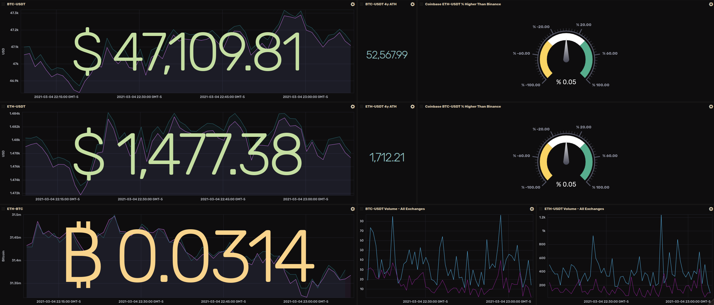

# coinprice price scraper

[](https://goreportcard.com/report/github.com/mochahub/coinprice-scraper)
[](https://lgtm.com/projects/g/mochahub/coinprice-scraper/alerts/)
<!--[](https://lgtm.com/projects/g/mochahub/coinprice-scraper/context:go)-->

[](https://ko-fi.com/X8X71S1S7)

<p align="center">
    
</p>

Web-Scraper for crypto prices built in Go.
1 Minute candle-stick data is scraped and stored in influxdb.

## Getting Started
### Requirements
- golang: `go version go1.16beta1 linux/amd64` (other versions not tested)
- docker & docker-compose
### Setting up Local Environment
- clone: `git@github.com:mochahub/coinprice-scraper.git`
- Create `.env` file via tempalte `cp env_example.txt .env`
  - Variables with a value of `<...>` need to be filled in by the user
  ```bash
    cat .env | grep '<...>' 
  ```
- install project packages: `go get -u ./... -v`
- run postgres & influxdb: `docker-compose up`
- run the app : `go run scraper/main.go`  

At this point you should see debug logs in the console of the scraper running, if this isn't the case please file an issue.


## Repo Structure
```markdown
├── scripts                     // Useful scripts (code coverage, database management, etc), all should run from root of repo
├── chronograph
│   └── dashboard               // Files you can import into chronograph dashboards (localhost:8086)
├── config                      // Handles secrets resolution (secrets, passwords, etc)
├── data                        // golang code to connect/query/save data to persistance services
│   ├── influxdb
│   └── psql
├── scraper                     // Entry point of the app lives in main.go
│   ├── app                     // Entry point of the scraper lives in initialize.go, it backfills data then starts a cron job
│   ├── models                  // Application models
│   ├── service
│   │   └── api                 // Implementation of scrapers for various exchanges 
│   └── utils                   // Helpers
```


## Data: Postgres Database Migrations and Models
- Database [models](data/psql/generated) are generated using the database schema via [sqlboiler](https://github.com/volatiletech/sqlboiler)
- sqlboiler introspects the database schema and creates the model files
- Before generating the models, the database needs to be running, and the migrations need to be executed
```bash
docker-compose up -d 
./scripts/run-database-migrations.sh
./scripts/generate-database-models.sh
```

### Process for Creating New Database Models
- Create a migration file under `data/psql/migrations`, and name it appropriately (ex. `2_new_migration.up.sql`)
- Run the migration script `./scripts/run-database-migrations.sh # run from the root of the repo` 
- Generate database models `./scripts/generate-database-models.sh # run from the root of the repo`

## Scraper
### Supporting New Data Sources (Exchanges)
- Create a new package under `service/api` with the name of the data source
- Create an `api_client.go` and `api_wrapper.go` and have them implement the `ExchangeAPIClien` type interface
- Create a wrapper method for the new data source in `service/api/module.go` 
    - ex. `func NewCoinbaseProAPIClient(...) ExchangeClientResult {...}`
- Add wrapper method to `GetAPIProviders` (this makes it available to the app via uber.fx dependency injection)
- Run the test file `service/api/exchange_client_test.go`

## Tests
- Run tests and update the `coverage_badge.png` via the following script
- The script will run all tests inside the `scraper` folder
```bash
./scripts/run-test-with-coverage.sh #run from root of the repo
```

## Chronograph
There is an example dashboard under `chronograph/dashboard`
<p align="center">
    
</p>
