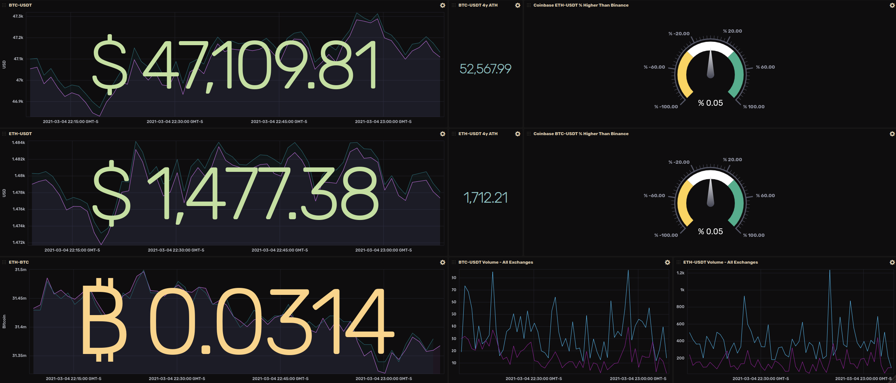

# Chainbot Prices 
<p align="center">

  <a href="https://codeclimate.com/github/chain-bot/prices/test_coverage"></a>
  <a href="https://codeclimate.com/github/chain-bot/prices/maintainability"></a>
  <a href="https://goreportcard.com/badge/github.com/chain-bot/prices">
    
  </a>
  <a href="https://lgtm.com/projects/g/chain-bot/prices/alerts/">
    
  </a>
  
  <a href="https://ko-fi.com/X8X71S1S7">
    
  </a>
  
</p>

Web-Scraper for crypto prices built in Go.
Web-socket feeds pull live prices from supported exchanges (WIP), 
with a minutely cron job filling in any missing data.
1 Minute candle-stick data is stored in influxdb.

Supported Exchanges:
- Binance
- CoinbasePro
- KuCoin
- FTX
- OKEX

## Getting Started
### Requirements
- golang: `go version go1.16beta1 linux/amd64` (other versions not tested)
- docker & docker-compose
### Running the Application Via Docker
```bash
# External Dependencies (psql, influxdb)
docker-compose --file ./build/docker-compose.yaml  --env-file ../.env up -d
# Build app docker image
docker image build -t prices -f build/dockerfile . 
docker run --name prices --env-file ./.env --network="host"  prices
# For future runs:
# docker start prices
# docker restart prices   
```

### Setting up Local Environment
- clone: `git clone git@github.com:chain-bot/prices.git`
- Create `.env` file via template `cp env_example.txt .env`
  - Variables with a value of `<...>` need to be filled in by the user
  ```bash
    cat .env | grep '<...>' 
  ```
- install project packages: `go get -u ./... -v`
- run postgres & influxdb: ` docker-compose --file ./build/docker-compose.yaml  --env-file ../.env up `
- run the scraper app : `go run app/cmd/scraper/main.go` 
- run the prices api server : `go run app/cmd/server/main.go` 

At this point you should see debug logs in the console of the scraper running, if this isn't the case please file an issue.


## Repo Structure
```markdown
├── app
│   ├── cmd
│   ├── configs                             // Handles secrets resolution (secrets, passwords, etc)
│   ├── internal                            // Scraper code + influx/psql interface code
│   └── pkg                                 // All API interface code
├── build
│   ├── docker-compose.yaml
│   └── dockerfile
├── docs
│   ├── chronograph
│   ├── cover.html
│   ├── env_example.txt
│   └── images
├── scripts
│   ├── run-test-with-coverage.sh           // Code Coverage Script (Run Before Making PR)
```


## Data: Postgres Database Migrations and Models
- Database [models](app/internal/data/psql/generated) are generated using the database schema via [sqlboiler](https://github.com/volatiletech/sqlboiler)
- sqlboiler introspects the database schema and creates the model files
- Before generating the models, the database needs to be running, and the migrations need to be executed
```bash
docker-compose --file ./build/docker-compose.yaml  --env-file ../.env up -d
./scripts/run-database-migrations.sh
./scripts/generate-database-models.sh
```
- Note: Running `main.go` will automatically run relevant migrations

### Process for Creating New Database Models
- Create a migration file under `data/psql/migrations`, and name it appropriately (ex. `2_new_migration.up.sql`)
- Run the migration script `./scripts/run-database-migrations.sh # run from the root of the repo` 
- Generate database models `./scripts/generate-database-models.sh # run from the root of the repo`

## Scraper
### Supporting New Data Sources (Exchanges)
- Create a new package under `app/pkg/api` with the name of the data source
- Create an `api_client.go` and `api_wrapper.go` and have them implement the `ExchangeAPIClient` type interface
- Create a wrapper method for the new data source in `app/pkg/api/module.go` 
    - ex. `func NewCoinbaseProAPIClient(...) ExchangeClientResult {...}`
- Add wrapper method to `GetAPIProviders` (this makes it available to the app via uber.fx dependency injection)
- Run the test file `app/pkg/api/exchange_client_test.go`

## Tests
- Run tests and update the `README.md` via the following script
- The script will run all tests inside the `app` folder (excluding sqlboiler generated files)
```bash
./scripts/run-test-with-coverage.sh #run from root of the repo
```

## Chronograph
There is an example dashboard under `docs/chronograph/dashboard`
<p align="center">
    
</p>
